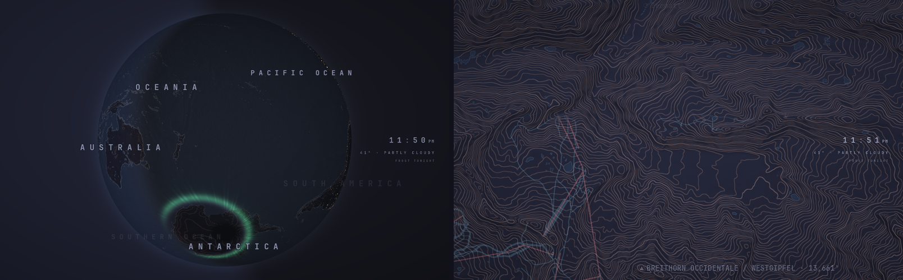
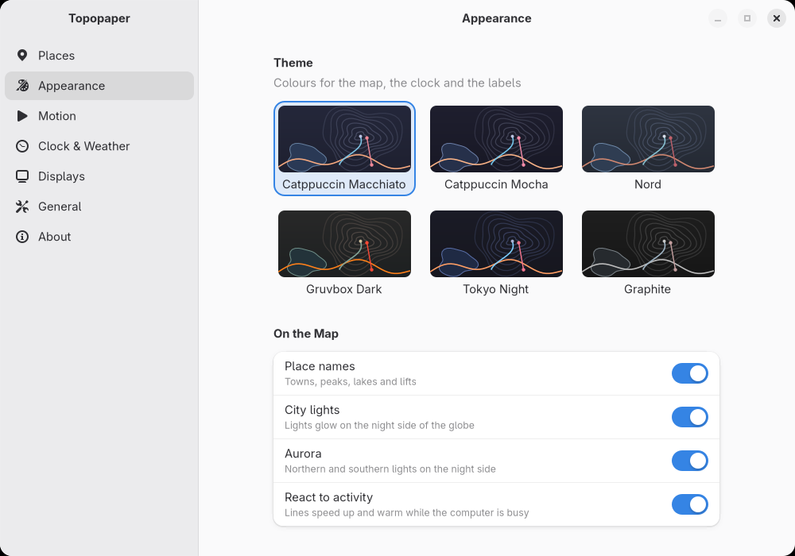

# topopaper

A live topographic wallpaper for Linux (Wayland), Windows and macOS. Your
desktop becomes a slowly breathing contour map of real terrain — from a globe lit by the actual sun,
down through mountain ranges and valleys, to the runs and lifts of a single
ski resort — with a quiet clock and the weather in the corner.



- **Real terrain anywhere on Earth.** Type a place ("Zermatt", "Yosemite",
  "Hokkaido") and topopaper builds a map of it from open elevation and
  OpenStreetMap data, then flies there.
- **One continuous atlas.** Every map is linked to the globe, so flights zoom
  smoothly from the planet down to a valley and back.
- **Alive, but calm.** Contours drift, the camera breathes, the day/night line
  and aurora follow the real sun, and the wallpaper freezes when windows
  cover it so it costs nothing while you work.
- **Clock and weather** (Open-Meteo, no account needed), themes, multi-monitor,
  and a settings app.

## Requirements

- **Linux**: a Wayland compositor that supports **wlr-layer-shell**:
  Sway/SwayFX, Hyprland, niri, river, Wayfire, KDE Plasma 6, and most
  wlroots-based compositors. **GNOME is not supported** (it has no
  layer-shell). OpenGL ES 2 (any GPU driver, or Mesa's software renderer),
  Python 3, GTK 4 and libadwaita (the installer handles this on Arch,
  Debian/Ubuntu, Fedora, openSUSE, Void and Alpine).
- **Windows** 10 or 11 (64-bit) with an OpenGL 2 graphics driver (every
  current GPU has one), and Python 3.9 or newer (the installer offers to
  install it with winget).
- **macOS** 10.15 or newer, the Xcode command line tools, and Python 3.9 or
  newer with Tk (the one from python.org, or `brew install python python-tk`).

How each system is supported, and what differs: [docs/PLATFORMS.md](docs/PLATFORMS.md).

## Install

**Linux and macOS**, in a terminal:

```sh
curl -fsSL https://raw.githubusercontent.com/aidenwboudr/topopaper/main/install.sh | bash
```

or from a checkout: `git clone https://github.com/aidenwboudr/topopaper && topopaper/install.sh`.

The installer checks your desktop, offers to install missing system packages
on Linux (it shows the exact command first), builds the wallpaper, installs
it into `~/.local`, downloads the starter globe (~30 MB), and asks whether to
start at login and whether to add a **Super+Shift+B** search shortcut.
Nothing in your compositor config changes without a yes.

**Windows**, in PowerShell:

```powershell
irm https://raw.githubusercontent.com/aidenwboudr/topopaper/main/install.ps1 | iex
```

It downloads the prebuilt wallpaper from the latest release into
`%LOCALAPPDATA%\Programs\topopaper`, sets up Python for the map builder, adds
Start menu entries, downloads the globe, and asks about starting at sign-in
and a **Win+Shift+B** search shortcut. No administrator rights needed.

Then open **Topopaper** from your app launcher or Start menu (or run
`topopaper-settings`) and tell it where home is.



To remove it: `./uninstall.sh` (keeps your maps and settings) or
`./uninstall.sh --purge`; on Windows, `uninstall.ps1` in the install folder
(`-Purge` deletes the maps and settings too).

## Using it

| | |
|---|---|
| **Settings** | `topopaper-settings` — maps, theme, clock and weather, motion, displays, autostart |
| **Go somewhere** | Super+Shift+B (Win+Shift+B on Windows; on macOS make one in the Shortcuts app), or `topopaper-ctl search` — pick a map or type any place |
| **Fly to a map** | `topopaper-ctl fly zermatt` (no name: the next map) |
| **Start / restart / stop** | `topopaper-ctl restart`, `topopaper-ctl stop` |
| **Something wrong?** | `topopaper-ctl doctor` checks the install and your desktop |
| **Everything else** | `topopaper-ctl --help` |

Building a new map takes a few minutes (the data comes from public servers);
the wallpaper keeps running and flies there when it's ready. The first map in
a new part of the world also gets a few coarser in-between maps so it zooms
smoothly out to the globe — those finish in the background and can take a
while when the public map servers are busy. Maps you searched
for are kept until you delete them in Settings → Places, or clean up old ones
with `topopaper-ctl gc`.

Settings live in `~/.config/topopaper/config.ini` (Windows:
`%APPDATA%\topopaper\config.ini`) — the settings app edits it, and so can
you; the wallpaper picks up changes within a second.

### Starting at login by hand

`topopaper-ctl autostart enable` sets this up for you on every system (on
Windows a sign-in entry, on macOS a LaunchAgent). If you'd rather add it to
your compositor config yourself on Linux, run `topopaper-session` at startup:

| compositor | line |
|---|---|
| Sway | `exec topopaper-session` |
| Hyprland | `exec-once = topopaper-session` |
| niri | `spawn-at-startup "topopaper-session"` |
| river / Wayfire / others | run `topopaper-session` from your autostart |
| KDE Plasma | System Settings → Autostart → add `topopaper-session` |

## Privacy

topopaper talks to a few public services, only when it needs to:
elevation tiles (AWS Open Data), OpenStreetMap's Overpass and Nominatim
(when you build a map or search), Photon (spelling suggestions), Open-Meteo
(weather), and — only if you leave the weather location on *automatic* — an
IP-geolocation service. Automatic locations are rounded to about 11 km before
being used anywhere. Nothing else leaves your machine, and there is no
telemetry.

## Data sources and credits

Maps are built from open data. If you share screenshots or maps, please keep
the credits:

- Map data © [OpenStreetMap](https://www.openstreetmap.org/copyright)
  contributors, available under the ODbL.
- Elevation: [AWS Terrain Tiles](https://registry.opendata.aws/terrain-tiles/)
  (Mapzen Terrarium; SRTM, GMTED, ETOPO1, USGS NED and others) and the
  [Copernicus DEM GLO-30](https://spacedata.copernicus.eu/collections/copernicus-digital-elevation-model)
  (© DLR e.V. 2010–2014 and © Airbus Defence and Space GmbH 2014–2018,
  provided under COPERNICUS by the European Union and ESA).
- Lakes on the globe: [Natural Earth](https://www.naturalearthdata.com/) (public domain).
- Weather: [Open-Meteo](https://open-meteo.com/) (CC BY 4.0).
- Geocoding: [Nominatim](https://nominatim.org/) and [Photon](https://photon.komoot.io/).
- Font: [JetBrains Mono](https://www.jetbrains.com/lp/mono/) (SIL Open Font License 1.1).

Please be kind to the free public servers: topopaper rate-limits itself and
caches everything it downloads.

## How it works

A small C engine draws the map with OpenGL: on a Wayland layer-shell
surface, behind the desktop icons on Windows, at desktop level on macOS.
Everything else (map building, search, weather, the settings app) is Python.
See [docs/ARCHITECTURE.md](docs/ARCHITECTURE.md) for the pieces,
[docs/PLATFORMS.md](docs/PLATFORMS.md) for the per-system parts and
[CONTRIBUTING.md](CONTRIBUTING.md) to hack on it.

## License

topopaper is free software under the [GNU General Public License v3.0 or
later](LICENSE). The bundled JetBrains Mono font is under the SIL Open Font
License 1.1 (`data/fonts/OFL.txt`); the generated Wayland protocol files keep
their MIT-style licenses.
